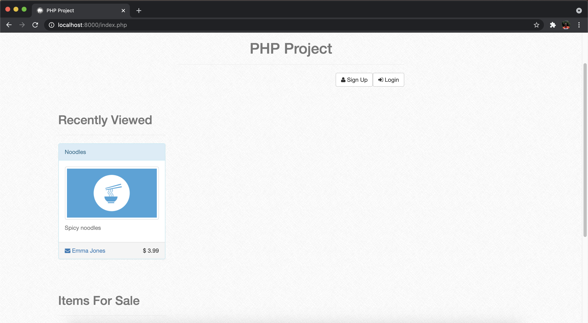
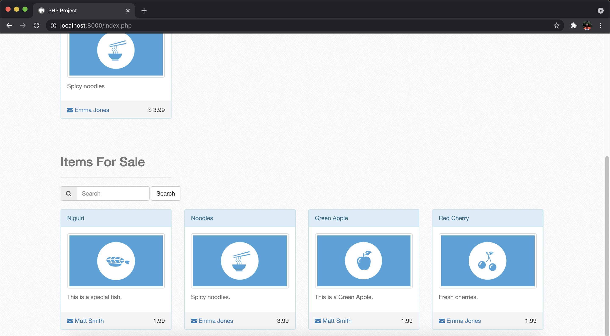
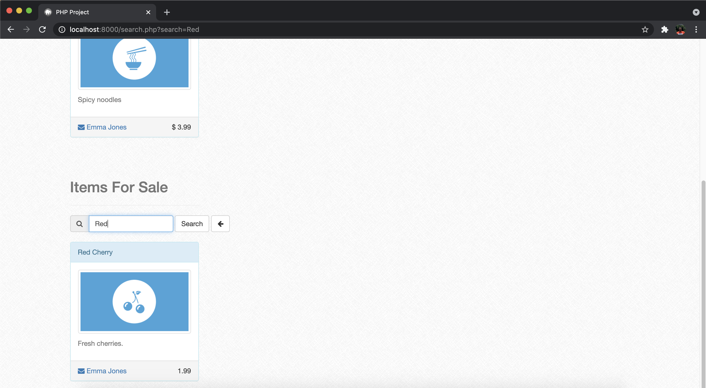
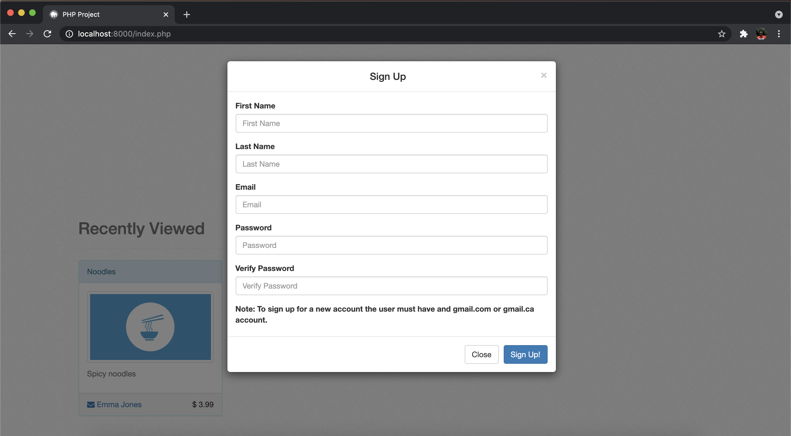
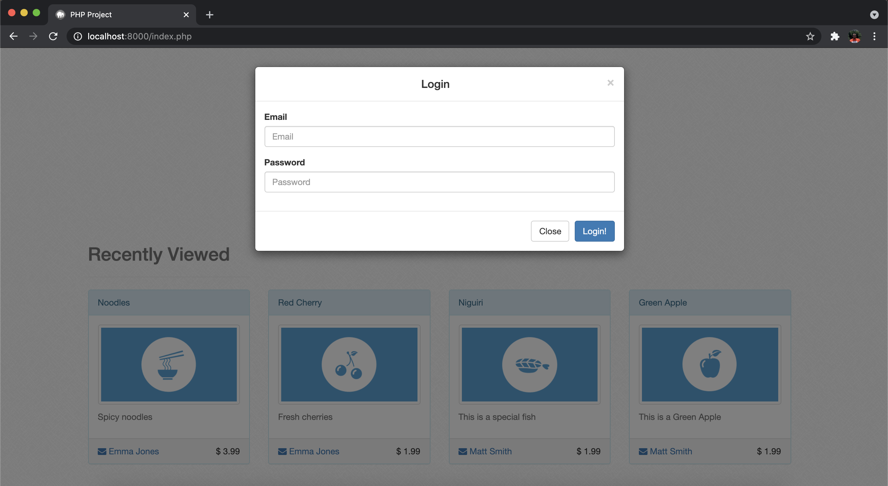
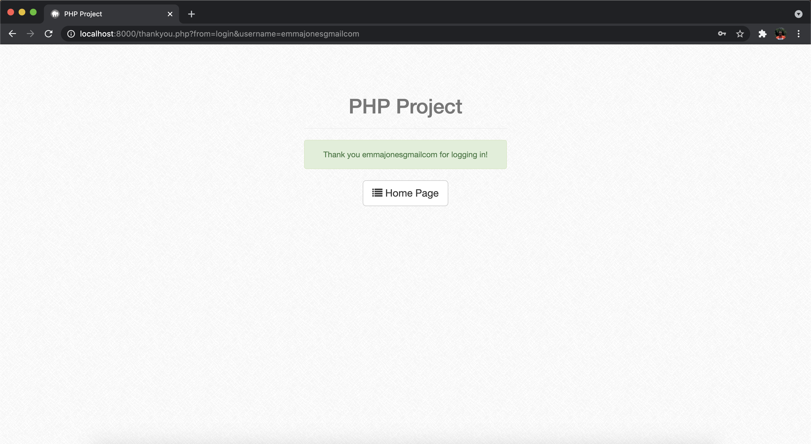
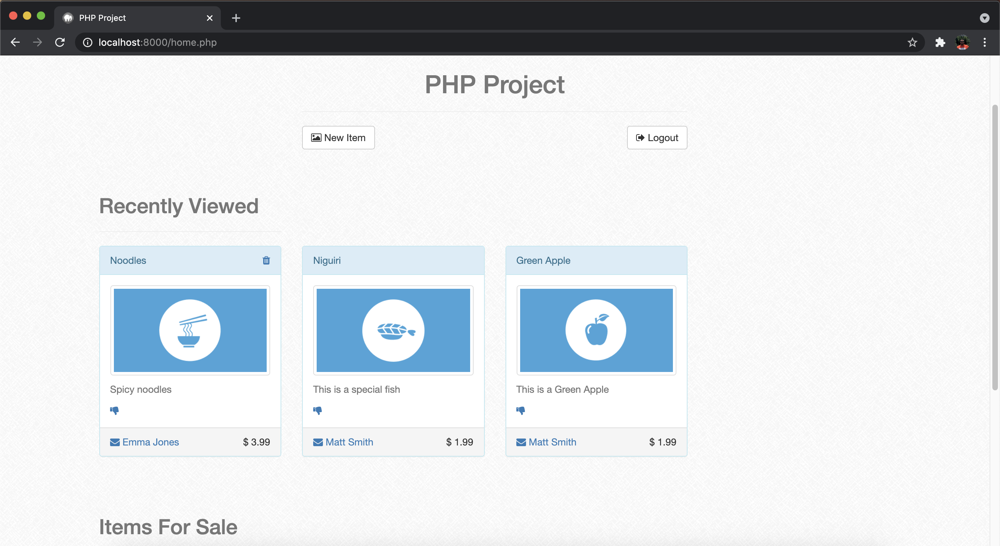
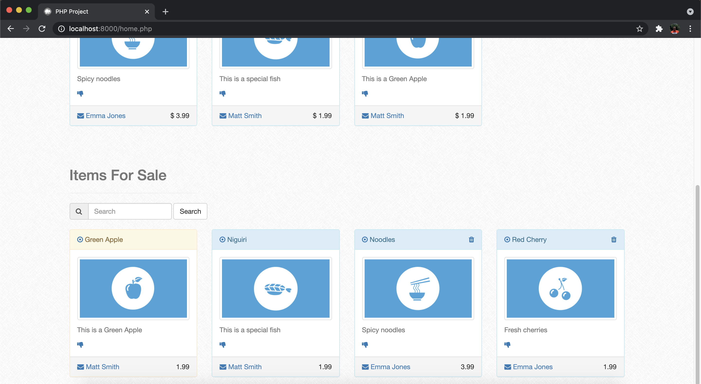
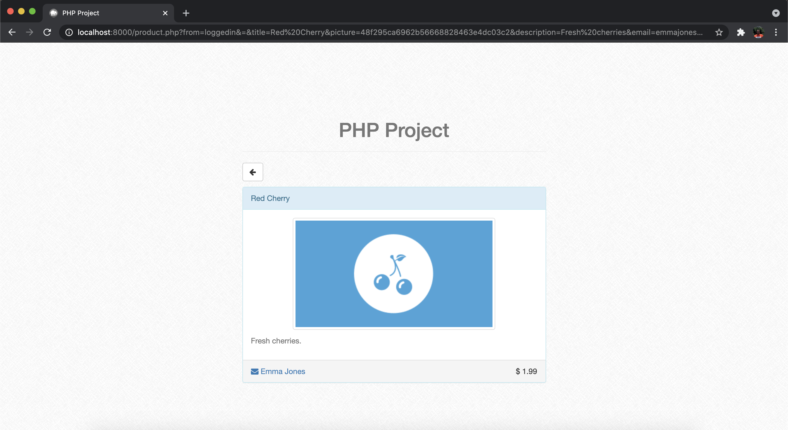

# PHP and MySQL Project

Project developed in PHP and MySQL for data storage.

The purpose of this project was to develop a platform where any user could view the available products. Only users who have an account can add new products, put a pin on the product to make it easier to find and delete products added by that user. A search bar can be used to search for the product within the database.

In the sql.txt file you can find how to create the databases.

